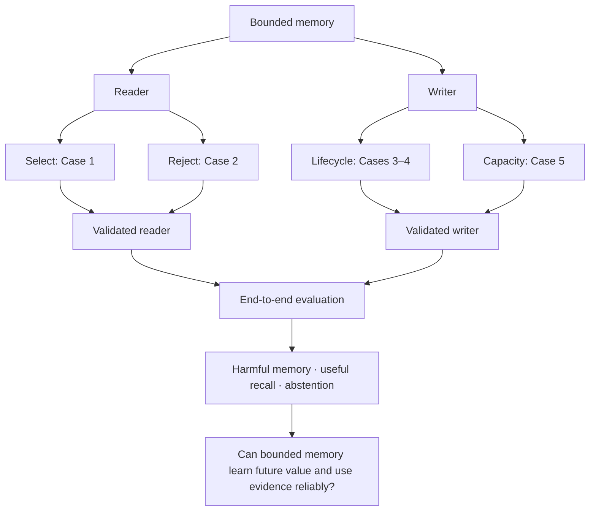

# Five-case bounded memory protocol

Approved scope, 2026-09-20: the user approved five cases with explicit oracle,
rejection-stratum, recovery-gate, and causal-utility changes, then requested
implementation and testing of every case. This protocol supersedes the earlier
review checkpoint. Historical Phase 1 code, data, and metrics remain frozen.

## Contract and implementation boundaries

- Four persistent slots are primary; eight are a declared capacity extension.
- Only bounded records survive resets; no raw history, cached activations, hidden
  fact archive, or future queries enter the reader or writer.
- Reader-only controls use existing `QueryView.memory/current/query`; neither
  `retained` nor full-world truth is a model input.
- The new writer stores a canonical fact bank of K × 4 int32 fields:
  entity, attribute, value, observed utility cue. Empty entity is -1. Deleted
  keys are removed; each correct bank has one record per key. This is 64 payload
  bytes at four slots, including the cue. It differs from Phase 1's event bank;
  old and new policy scores must not be compared as the same workload.
- Value copying is exact but does not check the selected key: selection errors
  remain observable. DELETE or the explicit UNKNOWN selection produces `??`.
- All models are trained from scratch on train symbols; validation and test use
  the existing separate full-symbol partitions. Digits remain shared.
- Supervise selector targets and lifecycle actions from currently visible
  evidence only. They are engineering controls, not answer-only learning claims.
- Capacity policy learning uses delayed answer rewards from completed training
  episodes. No oracle eviction labels, future-frequency labels, suffix features,
  or future query identity enter actor inputs or supervised training targets.
  Rewards become available only after the relevant queries occur.
- The future-aware retention oracle is evaluation-only and explicitly cheating.
- Case 6, latent slots/compression, dependency repair, and DEFER are excluded.

## Cases 1–2: reader

Four required systems:

1. Character reader on all visible records.
2. Learned selector followed by character generation.
3. The same learned selector followed by exact copying.
4. Visible-evidence oracle selector followed by exact copying.

The oracle selects the latest matching SET/UPDATE/DELETE from memory followed
by current operations, ignoring NOISE. It selects UNKNOWN when no matching
authoritative operation is visible. It must exactly agree with `read_visible`
on every generated task: 100% is an implementation assertion, not a learned gate.
It never recovers facts missing from the visible records.

Use the same selector decisions for systems 2 and 3 and the same character
weights for systems 1 and 2. Preserve a selected record's memory/current origin.
Log selector-index correctness, copied-answer correctness, generation correctness,
and their joint counts; these errors are not an additive statistical identity.

Case 2 has four separately reported strata:

| Stratum | Example | Correct answer |
|---|---|---|
| Unsupported | No authoritative visible fact about A | UNKNOWN |
| Contradicted/stale | Memory A=23, newer visible evidence A=45 | 45 |
| Irrelevant | Memory B=71, current evidence A=45, query A | 45 |
| Deleted | Visible A=23 followed by DELETE A | UNKNOWN |

Contradicted and deleted tasks include both within-bank and current-session
supersession. “Stale” means superseded by visible authoritative evidence here;
an unobserved world update is a writer-information issue, not readable evidence.
For every stratum retain empty-memory paired controls with the same query/current
session. Paired harm and benefit use all queries as their denominator.

Reader gate per seed: >=95% exact-match to visible-evidence targets overall,
on each required stratum, known/unknown targets, and full four-slot occupancy.
Never require 95% world-truth accuracy when memory has lost the answer.

On paired episode evaluation define A_N as neural world-truth accuracy, A_O as
exact visible-reader world-truth accuracy, and A_0 as exact reading of current
evidence with memory removed. Predeclare:

    ReaderRecovery = (A_N - A_0) / (A_O - A_0)

Require >=0.95 per seed when A_O > A_0. Otherwise report `null` and
`no_positive_oracle_gain`, not zero, one, or an epsilon-divided number. A reader
cannot be declared relatively validated without at least one required positive-
headroom control. Preserve raw accuracies and counts; do not clamp recovery.
This is normalized accuracy gain, not a causal fraction of recovered answers.
The episode gate requires positive headroom and >=0.95 recovery on every
nonempty-memory policy in A/B at four/eight slots, the lifecycle composition, and
each combined capacity condition. No-memory has no headroom and is excluded from
that required set. Missing headroom in a required control means unvalidated.
Also report neural-correct/oracle-wrong events (including lucky guesses) and
agreement with the visible oracle. Bootstrap paired episodes, not individual
seeds as if they were independent episodes.

## Cases 3–4: writer lifecycle

Train a small operation/target head for STORE, UPDATE, DELETE, IGNORE. An explicit
allocation target handles STORE when full; eviction is a separate capacity
decision. ABSTAIN belongs to reading. SET on an existing key supersedes its value.

Use symbolic key-equality and occupancy features in this first controller and
disclose that advantage. This isolates action/routing learning from representation
learning. Predictions must drive the executor; it must not silently correct a
wrong action or target using gold semantics.

Case 3: store A=old and B=keep, reset, update A=new, reset, query A and B.
Case 4: store A and B, reset, delete A, reset, query A and B. Include same-entity
different-attribute and same-attribute different-entity distractors. Keep these
tasks within capacity. Score through the exact reader first: action macro-F1,
target accuracy, transition correctness, stale answers, deletion non-abstention,
deleted-value repetition, and preservation of the unrelated control fact.
Require >=95% separately for semantic outcome, update, deletion, and control
preservation per seed for the lifecycle competence gate; report all metrics and any failed gate. Recency/exact lifecycle is a strong
control. Reading the operation label alone is not evidence of useful admission.

## Case 5: predictable versus unpredictable utility

First use a deliberately simple and interpretable write-then-query workload:
24 distinct entity/attribute keys, 30 writes (including six repeated-key updates)
across eight reset sessions, then 32 historical queries. Every key is observed
at least once. No current-session answer is supplied in the query phase, and a
query cannot reload an evicted fact. Capacity is four, then eight on identical
episodes. Candidate counts include updates, not 30 independent facts.

A binary persistent/durable cue is drawn for each key before any probe queries.
Exactly half the keys have each cue. It is observable on arrival and consumes
the fourth int32 field in every policy's slots.

- **A, unpredictable:** probe keys are independent uniform draws from the 24 keys.
  Cues carry no predictive information. Uniformly unpredictable future queries
  may offer no learnable admission advantage.
- **B, predictable:** each cue-1 key has five times a cue-0 key's query probability.
  The cue predicts a distribution, never a specific future query. The queried
  keys are sampled independently after the shared write stream is generated.

Train one capacity policy per seed on an equal mixture of A/B training episodes.
Use a small learned retention score, stochastic training decisions, and greedy
evaluation; disclose features and parameter count. Compare exact-lifecycle
FIFO facts, write recency, stateless random retention, bounded similarity reading,
and a fixed cue-priority heuristic as well as no memory. The cue heuristic is a
strong control: beating FIFO alone is insufficient. LRU has no meaningful
advantage in this write-then-query design and is deferred until interleaved access.

Changing only a future query suffix must leave each online policy's complete
write trajectory unchanged. All random evaluation choices must be reproducible
without an unreported episodic RNG state; a stateless hash may supply them.

For this workload, the clairvoyant optimum is exact: count final query requests
per key and retain the K keys with largest counts, with their latest values.
Those keys can be retained at their observed writes, so no raw-history reload is
needed to attain this hypothetical bound. Future counts are available only to
the evaluator. This closed-form oracle is not valid for arbitrary interleaved
updates/queries; changing the workload would require a new feasible oracle.

    Utility = correctly retained latest values / historical-answerable probes
    OracleRetentionRegret = Utility_oracle - Utility_policy

Report the exact-reader utility and regret per workload, capacity, and seed;
also state bytes, write/read time, historical tokens replayed (zero), seed
variation, paired intervals, and regret relative to the cue heuristic. A gain
in B and no systematic gain in A supports learning an observable utility signal,
not unrestricted future prediction or architectural novelty.

## End-to-end and run discipline

After independent evaluation, combine the learned lifecycle writer, learned
capacity policy, and selector/copy reader. Keep exact-reader and exact-lifecycle
substitutions to locate failures. Measure useful recall, paired harmful memory,
abstention, lifecycle integrity, and reader recovery. If a component misses its
gate, still save the combined diagnostic but label it unvalidated; completion of
the experiment does not imply successful hypotheses.

Freeze configuration and source before the first held-out read. Use seeds 7,19,43,
MPS when available and CPU otherwise. Save dataset/config/source/checkpoint hashes,
per-query predictions, learning curves, and synchronized timing. Preserve every
failed run. Development uses train/validation only; a failed test is not license
to retune and present another run on it as confirmation.

## Frozen local run budget

`projects/03-memory-reliability/configs/five-case-small.json` fixes three seeds,
65,535 balanced reader training tasks, 2,560 validation tasks, 6,000 steps each
for selector and character reader, batch 64, AdamW learning rate .002. Selector:
width 48, one block, four heads. Character model: width 96, two blocks, four
heads, context 128. Character supervision mixes full and oracle-projected prompts
50/50 with paired empty-memory examples. This differs from the historical reader.

Lifecycle: 4,096 causal training states, 300 steps, batch 128, width 32, Adam
learning rate .01. Capacity: 1,024 alternating A/B training episodes, learning
rate .03. Held out: 2,560 balanced reader tasks, 800 lifecycle episodes, 128
capacity episodes per workload with 32 probes each. Episode seeds are
2026092011/12/13 respectively. Bootstrap 2,000 whole-episode resamples. Reuse the
existing test symbol partition with fresh tasks; it is not an independent new
symbol partition. All component training finishes before test construction.
