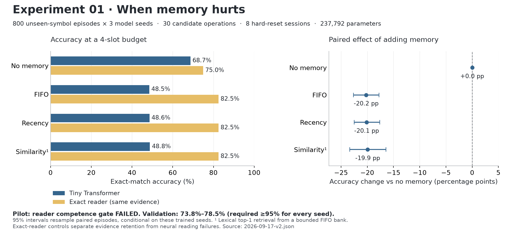

# Experiment 01 — When Memory Hurts

A local Phase 1 benchmark using the existing `TinyTransformerLM`: **30 candidate
operations, eight hard-reset sessions, four persistent slots**. Admission and
retrieval are hand-written policies. There is no learned memory controller yet.

## Measured result, 2026-09-17

The corrected second run used a **237,792-parameter** Transformer on the MacBook's
Apple MPS GPU, three training seeds, and 800 held-out episodes per scenario.
Training and all three evaluations finished in about **170 seconds**, excluding
Python startup. The table averages the three models on identical main episodes.

| Policy | Neural accuracy | Change vs no memory | Harmful answers¹ | Exact-reader accuracy² |
|---|---:|---:|---:|---:|
| No memory | 68.71% | — | — | 75.00% |
| FIFO | 48.50% | −20.21 pp | 23.21% | 82.50% |
| Recency | 48.58% | −20.13 pp | 23.17% | 82.50% |
| Similarity | 48.79% | −19.92 pp | 28.12% | 82.50% |

¹ No memory answered correctly and the memory condition answered incorrectly,
divided by all queries. Beneficial answers were 3.00%, 3.04%, and 8.21%, respectively.
² A deterministic exact-key reader of **the same retained evidence**, not full
history and not an oracle policy. It isolates policy retention from neural errors.



**Interpretation:** memory lowered this reader's accuracy in every seed, and
the paired episode-bootstrap intervals exclude zero. However, its visible-evidence
validation accuracy was only **73.83–78.52%**, below the predeclared 95% gate.
The exact reader benefits from memory and has zero stale/deleted errors here.
This is evidence of harmful *use* of memory by a weak reader, not proof that the
storage policies need a learned replacement. It is not yet a strong architectural
research result. Improve and validate the reader before Phase 2.

The longer-episode scenario (60 candidates, 16 sessions) and four-overwrite
scenario show the same direction. Full numerical results, case/gap/update-count
slices, abstention, retention, seed variability, and compute are in
[`results/2026-09-17-v2.json`](results/2026-09-17-v2.json) and the generated
[`report`](results/2026-09-17-v2.md).

## Run on this Mac or a CPU

From the repository root:

```bash
source .venv/bin/activate
python -m pip install -e ".[dev]"
pytest
python -m bounded_memory_transformer.memory_benchmark.evaluate \
  --config projects/02-memory-benchmark/configs/reader-extended.json
```

`bmt-memory-benchmark --config <config.json>` is the equivalent installed command.
`device: "auto"` selects CUDA, then Apple MPS, then CPU. To explicitly use CPU,
copy the configuration and set `device` to `"cpu"`. `baseline-small.json` is the
short 1,200-step configuration; `reader-extended.json` runs 6,000 steps per seed.
Use a new `--output` directory for every run: existing configurations are never
silently overwritten. No network, pretrained model, API key, or cloud GPU is
needed to run the experiment after Python dependencies are installed.

Every run writes configuration, exact source hashes and git revision,
environment, per-seed training curves/checkpoints, deterministic episode files
with hashes, every prediction with its bounded prompt, JSON metrics, and Markdown
results into `runs/when-memory-hurts-<timestamp>/`. These large local artifacts
are ignored by git. The two runs from this session remain under:

```text
runs/when-memory-hurts-2026-09-17-v1/
runs/when-memory-hurts-2026-09-17-v2/
```

Regenerate the standalone figure without retraining:

```bash
python -m pip install -e ".[plots]"
python projects/02-memory-benchmark/plot_results.py \
  projects/02-memory-benchmark/results/2026-09-17-v2.json \
  --output projects/02-memory-benchmark/results/when-memory-hurts
```

## Dataset and reset contract

`SET` and `UPDATE` assign authoritative values; conflicting SET replaces the old
value. `DELETE` invalidates the key, `NOISE` has no effect, and `ASK` returns the
latest value or `??`. Entity and value symbols are separate seeded 60/20/20
partitions of two-character decimal identifiers. Train, validation, and test
share characters, but no complete entity or value symbols.

Eight equally weighted cases cover historical SET, UPDATE, DELETE, never-seen
keys, current-session SET, UPDATE, DELETE, and similar-but-wrong keys. Half the
answers are unknown; an exact no-memory reader can also solve the two current
assignment cases, giving its 75% reference accuracy. These frequencies are
deliberate benchmark choices, not natural-world prevalences. Explicit UPDATE
appears in two of eight cases; current SET supplies another overwrite case.
Candidate count includes noise and repeated facts, not 30 distinct current facts.
The earlier handoff's tentative 20-candidate/50%-update recipe is superseded by
this recorded balanced design. The final session may contain local evidence
before ASK so no memory has a meaningful opportunity to outperform bad memory.

The unbounded state machine supplies scorer truth only. Each policy sees a
stream of current operations, without future query access during writing.
Between sessions only its fixed `K × 4` int32 array survives: operation, entity,
attribute, value. Record order supplies recency; no hidden timestamp or archive.
At four slots this is **64 logical payload bytes**, excluding Python overhead.

At query time the Transformer receives only retained records, current-session
operations, and the query. Its forward pass is stateless; it has no KV cache.
No activations or old token context cross a session boundary. This phase tests
structured memory serialization, not latent neural compression. Raw historical
tokens reprocessed are zero; bounded-state serialization is reported separately.

## Baselines

| Policy | Admission and eviction | Read |
|---|---|---|
| No memory | Discard all previous sessions | Current evidence only |
| FIFO | Last four factual events, including tombstones | All retained events, chronologically |
| Recency | Last four distinct keys; update/delete supersedes same key | All retained keys, by latest write |
| Similarity | Same four-event FIFO bank | One record by lexical key overlap; newest breaks ties |

All policies filter explicitly labelled NOISE. Similarity is a transparent
lexical control, **not a pretrained embedding retriever**. It never searches an
unbounded archive. It serializes seven memory characters per query, versus 28
for FIFO/recency, so read compute differs despite equal stored capacity. Costs
include synchronized batched read time and policy write/retrieve time. These are
single local timing observations, not a throughput benchmark.

One shared neural reader is trained per seed on independent short, balanced
visible-evidence microtasks. Targets are determined only by available evidence;
memory actions are not learned. All policy comparisons reuse the same frozen
weights, episodes, and greedy two-character decoding. Full history is available
only to the truth scorer, not to a competing neural model. LRU, learned policies,
and oracle admission are outside this four-baseline Phase 1 run.

## Metrics and uncertainty

- Exact-match accuracy and splits by case, evidence gap, and overwrite count.
- Stale-answer rate: output equals an obsolete value / updated answerable queries.
  This is a value-match measure, not proof of a causal read from that old memory.
- Deletion leakage: any non-abstention / deleted queries.
- Abstention precision, recall, and F1; invalid outputs are errors, not abstentions.
- Useful-fact retention: current target value in the bank / historical answerable
  queries. This measures stored evidence, before top-1 retrieval.
- Paired harmful/beneficial rates and net accuracy change, using all queries.
- 95% bootstrap intervals resample episodes, keeping all seeds for each episode
  together. They are conditional on these three trained seeds; per-seed accuracy
  and its sample standard deviation are also reported. They do not estimate
  population variability over all possible trained models.
- Logical state bytes, serialized memory/prompt tokens, raw historical tokens,
  policy time, training time, and batched inference time.

Zero-denominator rates are `null`, not fabricated zeros. All generators and
bootstrap draws have recorded seeds. CPU requests deterministic PyTorch kernels;
MPS run metadata is recorded, but exact cross-version/device replay is not promised.

## Pilot correction and provenance

The original 1,200-step pilot is preserved in
[`2026-09-17-v1.json`](results/2026-09-17-v1.json). Review found that its reading
microtasks excluded same-entity/different-attribute distractors. An
attribute-blind rule scored 512/512 on its validation examples. A regression
test failed before the correction and now finds 97 such failures among 512
validation examples. The pilot cannot serve as the primary result.

Before the second run, we fixed only that reading-data coverage and declared
the larger training budget and fresh episode seed 1729. We did not change the
held-out generator, policies, metrics, symbol partitions, model, or learning
rate. New episodes reuse the original held-out symbol partition; they are not
an independent unseen-symbol split. No further tuning followed the second test.

Exact source revisions: **v1 `7fc51fd`**, **v2 `280d88c`**. Every source hash in
both run manifests was checked against those commits. Use those revisions for
historical reproduction: the current short configuration uses corrected
microtasks and will not reproduce the original flawed pilot. Artifact hashes
are in [`provenance.json`](results/provenance.json). Saved harm examples are
illustrations; all aggregate statistics use the complete episode set.

The next milestone is a reader that reliably matches complete keys, copies
unseen values, handles deletion/precedence, and rejects missing evidence at full
slot occupancy. Only then test whether learned admission or abstention improves
on the strong structured-memory controls.
