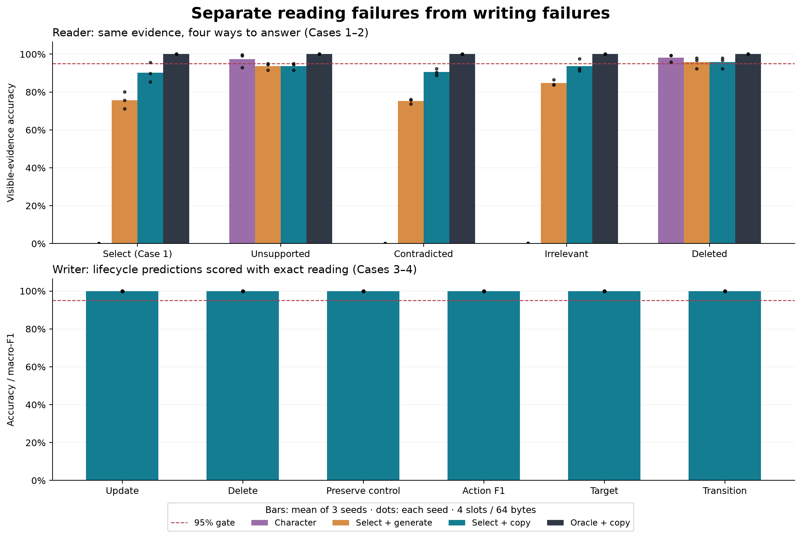
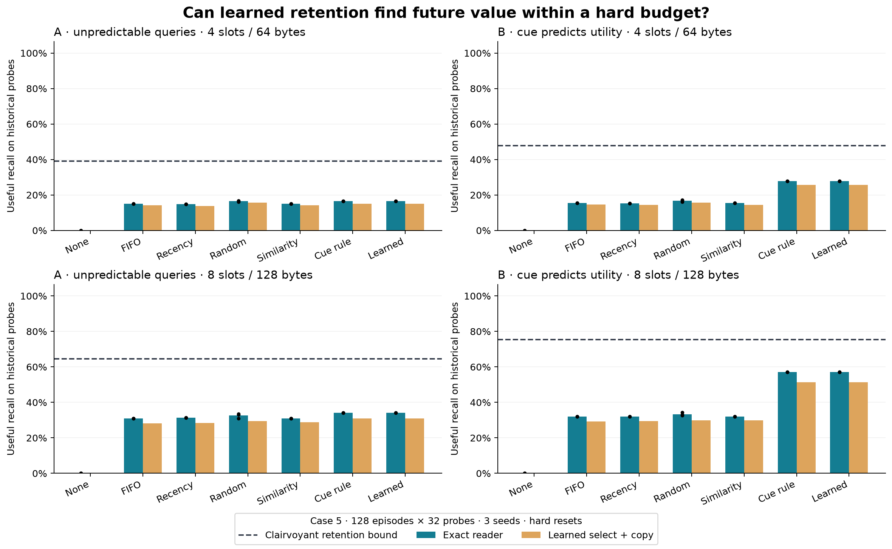

# Five-case bounded memory: measured results

Date: 2026-09-20. Source frozen at `4765f2f8295ce1d225638a38030ab6e85a985a2f`.
All five cases and combined diagnostics were implemented and run locally. The
run completed in **736.83 seconds (12.28 minutes)** on an Apple M2 Pro with 16 GiB
RAM. Cases 3–4 passed their controlled lifecycle gates. Cases 1–2 did not pass
the reader gates. Case 5 learned the planted utility cue and matched the strong
cue-priority heuristic. The combined system remains **unvalidated**.

This report distinguishes measured evidence, its interpretation, and future
hypotheses. No held-out retuning occurred. The previous Project 02 pilots remain
unchanged and use a different task mixture and memory representation.

## Evidence at a glance

| Question | Measured outcome |
|---|---|
| Does selection/copying help reading? | Mean accuracy 39.13% character → 85.03% select/generate → 92.83% select/copy; visible oracle 100%. |
| Are all rejection categories reliable? | No. Copy-reader category means range from 90.56% for contradiction to 95.77% for deletion; per-seed gates fail. |
| Can the writer update/delete without collateral damage? | 100% on controlled four-slot tests in every seed, using exact reading. |
| Can learning exploit predictable future usefulness? | Workload B useful recall: 27.91% versus FIFO 15.41% at four slots; 57.18% versus 31.98% at eight. |
| Does it beat the matching cue heuristic? | No; learned and cue-priority make the same greedy choices. |
| Is the complete neural system validated? | No. Absolute and relative reader gates fail in every seed. |

The [generated tables](../projects/03-memory-reliability/results/2026-09-20-v1/tables.md)
contain every seed, category, gate, paired interval, regret, and timing. The
[machine-readable summary](../projects/03-memory-reliability/results/2026-09-20-v1/summary.json)
retains configuration, source hashes, artifact hashes, counts, and full metrics.

## What was built and tested

The [approved protocol](../docs/superpowers/specs/2026-09-20-five-case-memory.md)
separates reader selection/rejection, writer lifecycle, and capacity decisions.
The new `memory_experiments` package reuses our manual Transformer blocks; it
does not replace the historical benchmark.

Each persistent slot is four int32 fields: entity, attribute, value, observed
utility cue. Four slots occupy **64 payload bytes**, eight occupy 128. The cue
is included in this budget. The no-memory control has zero state bytes. Only
the bank survives a session boundary; raw-history replay and KV-cache reuse are
zero. Shared immutable model parameters are separate from episodic memory.

Models: 237,792-parameter character reader, 30,050-parameter record selector,
869-parameter lifecycle controller, and 25-parameter retention scorer. This is
a small symbolic-memory study, not the illustrative 10M-parameter system or a
latent-memory architecture. The selector learns from query/record characters,
origin, and visible event order. The lifecycle model receives explicit symbolic
key-equality/occupancy features. The capacity scorer receives only a binary cue.

All training for seeds **7, 19, 43** finished before held-out data was constructed.
Each reader used 65,535 training tasks, 2,560 validation tasks, and 6,000 steps
each for selection and character generation. Character training mixed full and
oracle-projected prompts equally, including paired empty-memory examples. Final
checkpoints were evaluated; the run did not select checkpoints using test scores.
Lifecycle training used 4,096 states and 300 steps. Retention training used 1,024
alternating A/B episodes and delayed answer rewards, with no future action or
frequency labels.

The held-out set has 2,560 reader tasks, 800 lifecycle episodes, and 128 capacity
episodes per workload with 32 probes each. Every policy sees the same episodes.
Full entity/value symbols are disjoint from training, while digits are shared.
These are fresh episodes using the pre-existing test symbol partition, not an
independent new symbol partition. Eight-slot tests reuse four-slot-trained weights.

## Cases 1–2: selecting evidence helps, but the reader gate fails

All four arms start from the same evidence. The two character arms share one
character model, and learned selection is identical for generation and copying.
The oracle selects only from visible memory/current records; it cannot recover
facts already discarded. Oracle selection/copy agrees with the independent
visible-evidence rule on all tasks.

| Reader | Seed 7 | Seed 19 | Seed 43 | Mean |
|---|---:|---:|---:|---:|
| Character, full evidence | 39.77% | 39.84% | 37.77% | 39.13% |
| Learned selection → generation | 84.61% | 83.87% | 86.60% | 85.03% |
| Learned selection → exact copy | 92.19% | 91.02% | 95.27% | 92.83% |
| Oracle selection → exact copy | 100% | 100% | 100% | 100% |

**Evidence:** the same character weights answer much better after selection.
Replacing generation with copying adds a further 7.80 percentage points on
average. Across the three seeds, there are 599 instances where copying is
correct and generation from the same selected record is wrong, and zero in the
reverse direction. These joint counts diagnose the stages; they are not an
additive identity for independent error sources.

The copy-reader means by stratum are: select 90.30%, unsupported 93.75%,
contradicted 90.56%, irrelevant 93.75%, deleted 95.77%. Every stratum has 512
examples. High UNKNOWN accuracy alone would hide poor known-answer reading:
the full character reader is correct on only 0.02% of known targets on average.
The copy reader reaches 91.54% on known and 94.76% on unknown targets.

**Gate outcome:** every seed fails. Seed 43's aggregate 95.27% is insufficient:
its contradiction accuracy is 90.43%, unsupported accuracy 94.53%, and known
accuracy 94.60%. Final selector validation accuracies were 92.03%, 91.76%, and
93.91%, so validation also failed the absolute requirement.

The exact current-only reader scores 80% on these tasks, while the exact visible
reader scores 100%. Seed 7's predeclared recovery is therefore
`(0.921875 − 0.80) / (1.00 − 0.80) = 60.94%`. Seeds 19/43 recover 55.08%/76.37%.
With this 20-point headroom, the 95% recovery target requires 99% overall accuracy.
This explains why “about 93% accuracy” does not satisfy the relative criterion.
The metric uses an exact current-only baseline; paired harm/benefit separately
compares each neural arm with its own empty-memory answers.

For selection/copy, mean paired harm is 0.31% of all reader tasks, with seed
rates 0.51%, 0.08%, and 0.35%. These are rare but nonzero changes from a correct
empty-memory answer to a wrong memory-conditioned answer. Abstention precision
ranges 90.52–97.21%; recall ranges 91.99–96.29%. All denominators are in the summary.

**Concrete failure:** seed 7, reader episode 19 asks `(04,b)`. Visible evidence
includes `DELETE (04,b)`, but selection chooses `UPDATE (64,b)=69`. Copying then
returns 69 rather than UNKNOWN. This is a key-selection failure, not missing
storage. The [saved examples](../projects/03-memory-reliability/results/2026-09-20-v1/examples.json)
use the first matching failure in deterministic row order, rather than selected
examples being used to estimate rates.

## Cases 3–4: controlled lifecycle succeeds with exact reading

Per seed, 800 episodes yield 5,600 write/noise operations, 3,200 applicable
target decisions, 400 update queries, 400 deletion queries, and 800 unrelated
control queries. The tasks remain within four-slot capacity, so eviction cannot
explain failures. Each includes hard resets and key-coordinate distractors.

**Evidence:** action accuracy/macro-F1, target accuracy, one-step transition
accuracy, update answers, deletion answers, and control preservation are all
100% in all three seeds. Stale-value answers, deletion non-abstention, and
deleted-value repetition are all zero. Exact lifecycle is also 100%.
One-step transition correctness is measured from the bank actually encountered;
final query truth is independent of that bank.

**Interpretation:** a tiny controller learns these supplied features and routing
labels. This validates the controlled writer instrument. It does not demonstrate
learning key equality from language, superiority over correct rules, or unlimited
generalization under capacity pressure.

With the learned reader added to those same writer banks, lifecycle answer
accuracy becomes **81.75%, 94.81%, and 95.19%**. Perfect storage can still yield
wrong answers. At eight slots under capacity pressure, the learned writer also
occasionally produces different retention outcomes from exact lifecycle; the
four-slot controlled result does not establish universal writer competence.

## Case 5: learning the planted utility signal

Both workloads contain 24 distinct keys and 30 writes across eight sessions,
including six updates, followed by 32 historical probes. Query suffixes never
enter the online actor. Workload A samples keys uniformly; in B, cue-1 keys are
five times as likely to be queried as cue-0 keys. Each workload has 12 keys of
each cue, assigned before queries. The same prefixes are used for A and B.

Useful recall is the fraction of historical probes answered with the latest
value. No-memory is **0% here** because every probe needs past information. The
old Phase 1 score of 68.71% included a different mixture of current, deleted,
unknown, and historical queries. These absolute scores are not comparable.

| Policy, exact reading | A: 4 slots | A: 8 slots | B: 4 slots | B: 8 slots |
|---|---:|---:|---:|---:|
| FIFO | 15.01% | 31.01% | 15.41% | 31.98% |
| Recency | 14.84% | 31.35% | 15.23% | 31.96% |
| Stateless random | 16.48% | 32.58% | 16.76% | 33.31% |
| Similarity | 15.01% | 31.01% | 15.41% | 31.98% |
| Cue-priority rule | 16.50% | 34.08% | 27.91% | 57.18% |
| Learned retention | 16.50% | 34.08% | 27.91% | 57.18% |
| Future-aware oracle | 39.06% | 64.48% | 47.71% | 75.32% |

Similarity retrieves one record from the bounded FIFO bank. Correct exact-key
reading already handles the full bank, so this retrieval step cannot improve
exact accuracy here. It changes neural evidence exposure and reading cost.

**Evidence:** every learned retention seed matches cue-priority. Relative to
FIFO, B gains **12.50 percentage points** at four slots (95% paired episode
interval **10.40–14.65**) and **25.20 points** at eight (**22.44–27.88**). Relative
to cue-priority the difference and interval are both zero. All model seeds share
the test episodes; identical decisions are not three independent dataset replications.

**Unexpected control result:** A gains 1.49 points at four slots, with interval
−0.37 to 3.39, and **3.08 points at eight slots, with interval 0.76 to 5.64**.
The latter is a positive observed contrast and must not be relabelled “no effect.”
The declared uniform distribution has no population cue advantage: any complete
K-key bank has expected utility K/24. Finite-sample variation or other generator
structure are possible explanations for the observed contrast; this run does
not distinguish them. A separately preregistered episode replication is needed
before claiming a repeatable uniform-workload advantage. These intervals are
per comparison, conditional on the fixed seeds, without multiplicity adjustment.

**Oracle and regret:** the future-aware oracle uses the actual probe counts to
retain the K most-requested keys with their latest values. That bound is feasible
for this write-then-query task and unavailable to the learned policy. In B, learned
regret is **19.80 points** at four slots and **18.14 points** at eight; FIFO regret
is 32.30 and 43.33. The whole oracle gap is not necessarily learnable: an optimal
cue-based choice has expected utility 5K/72, or 27.78%/55.56%, while the oracle
knows the realized future sample. The learned scores are consistent with recovery
of that planted heuristic.

## Combined diagnostics and limits

Combining learned lifecycle, learned retention, and selection/copy gives mean
B useful recall **25.63% at four slots** and **51.35% at eight**. Corresponding
exact-reader means are 27.91% and 57.18%. Mean normalized recovery is
91.83%/89.81%; per-seed reader gates still fail. The same combination yields
15.16%/31.03% learned-reader recall on A. These are diagnostic results.

In one eight-slot B example, `(15,a)=00` remains in the bank, but seed 7 selects
`(35,a)=12` and answers 12. This directly separates retention success from reader
failure. Zero paired capacity harm is uninformative here: the empty-memory
baseline gets no historical probes right, so no baseline-correct answer can be
damaged. Use the reader/lifecycle controls to examine rejection and abstention.

Capacity queries are all after writes; there are no interleaved accesses or
capacity-phase deletions. Deletion is tested separately in Case 4. Evidence is
authoritative, so UNKNOWN rejection does not establish uncertainty calibration
for unreliable sources or unobserved updates. LRU, DEFER, dependency repair,
latent compression, and natural-language conversations remain outside this run.

## Reproducibility, compute, and verification

The [project README](../projects/03-memory-reliability/README.md) contains runnable
commands. The checked-in configuration uses Python 3.13.7/PyTorch 2.9.1 on the
recorded machine, MPS readers, CPU controllers, and four CPU threads. Training
took 161.27, 171.49, and 171.98 seconds per seed. Remaining runtime includes all
evaluations and artifact writing. Four-slot B policy writing averaged 0.260 ms
per episode for FIFO, 0.150 ms for cue-priority, and 0.721 ms for learned retention.
Learning adds compute; equal bytes do not imply equal cost. Joint neural timings
include four arms and their empty-memory controls, not isolated per-arm latency.

The independent [audit report](../projects/03-memory-reliability/results/2026-09-20-v1/audit.json)
passes all recorded source/artifact hashes and recalculates metrics from
405,696 reader prediction rows, 33,600 lifecycle operation rows, 12,288 capacity
banks, and 46,080 combined write records. These counts include controls, policies,
capacities, and repeated seeds; they are not independent dataset sizes. The audit
imports no experiment metric/evaluation functions. Tampered metrics, altered
checkpoint hashes, and incomplete runs were also checked to fail. The unit and
integration suite contains **95 passing tests**, and Ruff is clean.

Full checkpoints, datasets, bank histories, and predictions remain locally in
`runs/five-case-2026-09-20-v1` in the five-case worktree (about 362 MiB). Compact
results, hashes, figures, examples, and the console log are checked in. Hashes
verify recorded artifacts; they do not independently prove causal training.
Source review and suffix-invariance tests establish that control boundary.

## Next hypotheses, not additional results

The next reader study should use train/validation development to separate full-key
matching, precedence, and UNKNOWN thresholds, varying current-record count and
occupancy so zero-current capacity views are represented. Preserve these failed
results and freeze a new held-out protocol before another claim. Exact copying
remains a useful control while selection is improved.

For retention, the next question is whether a bounded policy can infer useful
patterns from past accesses rather than a single supplied durability cue. That
requires a declared interleaved workload, bounded access metadata, and appropriate
LRU/frequency controls. Separately replicate A on new episode draws. No new
architecture or latent compression is justified by this run alone.
