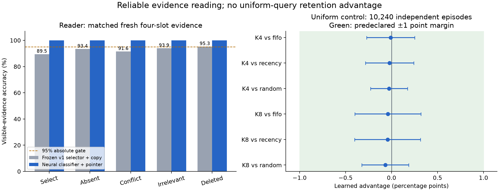

# Reader reliability, uniform replication, and emergent utility

Date: 2026-09-20. **Measured result:** the structured neural reader passes the
declared symbolic-evidence gates; the uniform retention advantage does not
replicate. **Design only:** Case 5B emergent utility remains unimplemented.

Figure: the left panel compares readers on identical fresh four-slot evidence,
averaged over three model seeds. The right panel uses 10,240 independent episodes
and approximate Bonferroni familywise 95% intervals for six paired contrasts.
The green region is the predeclared ±1 percentage-point equivalence margin.

## What changed in the reader

The earlier selector commonly chose the right attribute of the wrong entity.
Fresh four-slot validation diagnosis found that error in 506 of 533 failures
across the frozen seeds. More training on the same undifferentiated record score
was not the chosen intervention.

The replacement has **7,639 parameters** and uses the existing inspectable
Transformer block. A shared neural comparator reads three-token character pairs
for the two entity digits and attribute. Training first teaches all 116 valid
digit/digit and attribute/attribute pairs from the training alphabet, then freezes
that comparator. A second stage learns operation authority and chronology from
record-selection tasks. Values are excluded from selection and copied exactly
from the chosen record; copying does not check or repair a wrong key.

The final inference rule classifies each key component and operation authority
at the fixed zero-logit boundary. All four must be positive. Eligible records
then compete using the learned chronology coefficient; absent eligible evidence
produces UNKNOWN. **This is a neural classifier with deterministic composition
and an exact-copy pointer.** It is not evidence that an unrestricted character
generator, fully learned ranking system, or source-trust estimator has been fixed.
The decomposition and exhaustive primitive supervision are strong engineering aids.

## Development failures were preserved

All changes below preceded the new reader's held-out evaluation. The original
Project 03 models, generators, metrics and results remain unchanged.

| Development version | Observation and action |
|---|---|
| 1: factorized scorer | Perfect seed-7 validation, but a new generator accidentally tied question category to occupancy. Rejected as coverage evidence; the generator and regression test were fixed. |
| 2: corrected coverage | Seeds 19/43 reached 100%; seed 7 remained at 98.5% on original validation tasks and failed required gates. A particular attribute mismatch caused unsupported answers. |
| 3: pretrained/frozen comparator | All original validation gates passed. An additional probe of all nine ordered SET/UPDATE/DELETE pairs scored only 66.67% for every seed/budget. Operation confidence could override later evidence. |
| 4: confidence saturation plus transition training | Original validation stayed perfect, but ordered-transition accuracy remained 66.67–77.78%. Saturation alone did not reliably separate validity from chronology. |
| 4 weights + binary readout | No additional training or threshold search. Fixed classifier decisions plus chronology passed all 12 validation conditions for each seed, then proceeded to the frozen held-out evaluation. |

The original three-candidate development budget was explicitly amended before
test opening for a fourth training configuration and a fifth readout variation.
The [protocol](reader-followup-protocol-2026-09-20.md) records why. These failures
show why an aggregate 100% score on a narrow validation suite was insufficient.
All training histories and the flawed first generator are preserved in the
[development archive](../projects/04-memory-followup/results/2026-09-20-v1/development.json).

## Held-out reader results

Reader source/configuration were frozen at `1845235`. All three final checkpoints
existed before any follow-up test generator ran. Test episodes use fresh seeds
and the existing disjoint test entity/value partition. The model has not trained
on those full entity/value symbols; the shared character alphabet is familiar.
This is not a new research-level untouched vocabulary partition.

| Reader, same fresh original four-slot tasks | Seed 7 | Seed 19 | Seed 43 | Mean |
|---|---:|---:|---:|---:|
| Frozen v1 learned selector → copy | 92.38% | 90.66% | 95.18% | 92.74% |
| Revised neural classifier → pointer/copy | 100% | 100% | 100% | 100% |
| Exact visible-evidence reader | 100% | 100% | 100% | 100% |

There are 5,000 original tasks at each capacity, 2,000 varied tasks per capacity
and current-count condition, and 1,800 ordered-operation challenges at each
capacity. This totals **29,600 reader microtasks**, shared across model seeds.
Each seed also reads 800 lifecycle episodes and every declared capacity/combined
control: 41 conditions per seed, **123 condition evaluations** overall.

Every required nonempty category reaches 100% visible-evidence accuracy. This
includes selection, unsupported, contradicted, irrelevant, deleted, each tested
occupancy, evidence origin, and all nine authoritative transitions. Memory budgets
are four/eight slots; varied occupancy includes empty banks. Current-record counts
are 0/1/6/32. Thirty-two exceeds the maximum training count of twelve. Each seed
also achieves **100% oracle-relative recovery in every condition**, including
all 29 episode controls. There are no unavailable recovery conditions in the full
run and no observed paired harmful answers across 437,664 saved reader rows.

Those 437,664 rows repeat episodes across models and policies; they are not that
many independent experimental draws. Zero observed harm is limited to these
symbolic, authoritative inputs. The 95% gates are point-estimate engineering
criteria, not population lower-confidence guarantees. Capacity-only harm of zero
is uninformative when its no-memory control has zero world accuracy.

**Reading accuracy is not retention accuracy.** The revised reader agrees with
what its bank supports. On the fresh planted-cue B episodes, exact lifecycle plus
learned retention yields only 28.61%/57.69% world recall at four/eight slots; the
neural reader now recovers those same values. Frozen learned lifecycle plus
learned retention averages 28.83%/57.85%. Differences in the latter banks belong
to the writer; they are not reader improvements or a fresh utility-learning claim.
The controlled lifecycle reader reaches 100% in all seeds.

If a newer update is neither retained nor visible, this reader has no independent
way to know that a plausible old value is stale. It has not learned calibrated
trust in uncertain sources. Similarly, UNKNOWN on a discarded live fact is correct
relative to available evidence but still loses world recall. Both denominators
remain reported in the complete results.

## Uniform negative-control replication

The separate [replication protocol](uniform-replication-protocol-2026-09-20.md)
was committed at `569c387` before generation. It reused the original frozen
retention checkpoints and unmodified generator, with 20 fixed dataset seeds,
512 episodes each, 24 keys and 32 uniform probes: **10,240 independent episodes**
and 327,680 probe draws. No retraining or learned-reader change enters this test.

| Policy | Four-slot recall | Eight-slot recall |
|---|---:|---:|
| Learned | 16.6956% | 33.3240% |
| FIFO | 16.7047% | 33.3630% |
| Recency | 16.7169% | 33.3667% |
| Random, mean of three policy seeds | 16.7227% | 33.3917% |
| Population expectation K/24 | 16.6667% | 33.3333% |

For any full bank of K distinct current keys, uniform-query success is K/24.
The audit verifies that these banks satisfy that premise. Random seeds are
averaged within episodes before inference; they do not triple the sample size.
All three learned checkpoints have identical greedy decisions, established by
544 exhaustive cue-allocation checks per model. They are prediction aliases,
not independent dataset replications.

| Learned minus baseline | Difference, percentage points | Corrected analytic interval |
|---|---:|---:|
| FIFO, K4 | −0.0092 | [−0.2711, +0.2528] |
| Recency, K4 | −0.0214 | [−0.2835, +0.2408] |
| Random, K4 | −0.0272 | [−0.2280, +0.1737] |
| FIFO, K8 | −0.0391 | [−0.3985, +0.3204] |
| Recency, K8 | −0.0427 | [−0.4010, +0.3156] |
| Random, K8 | −0.0677 | [−0.3230, +0.1875] |

All six corrected analytic intervals **and** the independently recomputed
10,000-replicate paired bootstrap intervals include zero and lie inside the
predeclared ±1-point practical-equivalence margin. This meets the stated
equivalence criterion, beyond merely failing to find significance. It does not
prove exact equality for every possible workload.

The previous +3.08-point A8 advantage over FIFO **did not replicate**. Its original
positive interval remains in the historical report. The new evidence is consistent
with sampling variation in that small run; it supplies no evidence of predicting
unpredictable future queries. It also does not test emerging access-based utility.

## Compute, audit, and reproducibility

Apple M2 Pro, 16 GiB; Python 3.13.7; PyTorch 2.9.1. Final candidate-4 training
with validation took 246.93 seconds across seeds 7/19/43 on MPS. Reader evaluation
took 115.73 seconds. The independent CPU uniform replication took 189.96 seconds.
Earlier development runs and audits cost additional time. Some independent work
ran concurrently, so these timings are observational, not isolated speed trials.

Uniform write time summed over 10,240 episodes was 7.77/6.71 seconds for learned
at K4/K8, versus FIFO's 2.75/2.60 seconds. Learned compute buys no uniform benefit.
Both use 64/128 persistent bytes. Reader parameters and temporary computation are
separate from episode state; inference replays zero raw historical tokens.

The independent reader auditor checked 211 artifact hashes, 54 source/checkpoint
hashes, 12 checkpoints and all 437,664 prediction rows. It reconstructs visible
semantics, copy decisions, bank evidence, categories, metrics, paired bootstrap
intervals and gates without importing experiment metrics. It verifies copied
neural indices rather than rerunning every neural forward pass.

The independent uniform audit verified 263 artifact hashes, replayed 122,880
banks, checked 3,932,160 saved query records, and recomputed all contrasts and
bootstrap replicates without project imports. Both audits passed. The uniform
audit includes its exact standalone program. Tests also reject incorrect source,
checkpoint, configuration, category and metric artifacts.

See [Project 04](../projects/04-memory-followup/README.md) for commands, frozen
revisions and artifact locations. Raw runs are preserved locally; compact
summaries, audits, development history and the figure are checked in. No held-out
reader model, dataset, metric or gate was changed after test opening.

## Case 5B: what remains to test

The [emergent-utility design](case-5b-emergent-utility-design.md) defines a distinct
protocol, `case_5b_emergent_utility_v1`; it does not replace historical planted-cue B.
It includes interleaved accesses without ASK refills, charged 64/128-byte state,
strong access-based heuristics, held-out abrupt-drift/recurrence/scan mechanisms,
five model seeds, four generator blocks, and twelve budget/length/family cells.
The robust-result criterion demands at least two percentage points over every
required heuristic and the no-access ablation in every cell, with positive
simultaneous paired lower bounds and consistency across model seeds.

**Evidence:** reading instrumentation is competent on the declared symbolic suite;
uniform retention has no practically meaningful advantage. **Inference:** the
capacity study can now be tested without the previous reading bottleneck.
**Hypothesis:** past access summaries may support learned utility that transfers
better than strong cache heuristics. No Case 5B model or results yet support that
hypothesis, and no research-novelty claim follows from this session.
