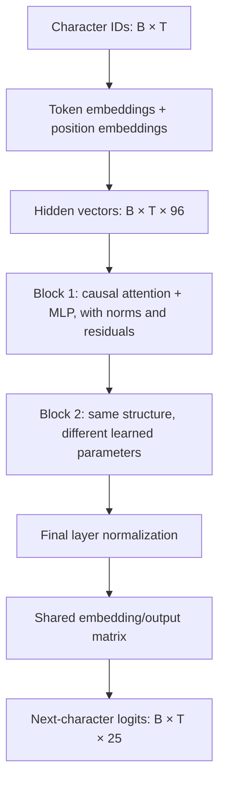
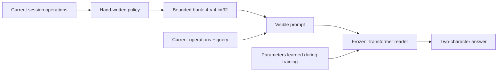

# Learning our Transformer, from numbers to memory experiments

Verified against this repository on **2026-09-17**. This is a course through the
implemented system, using small examples before introducing the full tensors.
The main example is the Phase 1 memory reader: **237,792 trainable parameters,
two decoder blocks, four attention heads, and a maximum context of 128 character
tokens**.

The project has two connected parts. Project 01 implements a small Transformer
and its training loop. Project 02 places that same architecture beside a bounded
symbolic memory store and measures how well it reads the available evidence.
The long-term research goal is to learn memory management. **The current model
learns reading; its memory policies are still written by us.**

Work through sections 1–12 to understand the neural network. Sections 13–17
connect it to the memory experiment. Section 18 contains executable exercises.
You do not need to understand every equation on the first reading: first follow
what each object represents, then check its shape, then follow the arithmetic.

## 1. What problem is a language model solving?

A language model estimates the next token from the tokens already present:

\[
P(x_{t+1}\mid x_0,x_1,\ldots,x_t;\theta).
\]

Here, `x` is a token ID, `t` is its position, and `θ` means all learned model
parameters. A parameter is a number adjusted during training. For example, an
embedding coordinate or one entry of an attention projection is a parameter.

In our model, a token is **one character**. Given `Memor`, the next-token task
could be to predict `y`. Given a memory-question prompt ending in `=`, the next
token could be the first character of a two-character answer.

A model does not begin with the meanings of `SET`, entity identifiers, or
deletion. We define the data format and provide examples. Training adjusts its
parameters to make the examples' correct next tokens more probable.

Three objects must stay separate:

| Object | Example | What it does |
|---|---|---|
| Architecture | Two attention/MLP blocks | Defines which calculations are possible |
| Parameters | Entries of a learned matrix | Determine the calculation's current behavior |
| Input data | A serialized fact and a query | Supplies the particular problem to solve |

Changing the input is inference. Updating parameters from a loss is training.
Changing the architecture changes the family of computations we can train.

## 2. The mathematics we need

### Scalars, vectors, matrices, and tensors

A **scalar** is one number, such as `0.7`. A **vector** is a list of numbers,
such as `[2, -1, 3]`. A **matrix** is a rectangular table. A **tensor** is the
general term, including tables with more axes.

The shape `[2, 5, 96]` means two examples, five token positions per example, and
96 numbers describing each token position. The shape describes the organization
of numbers; it does not tell us what those numbers mean.

### A dot product measures compatibility

Multiply corresponding vector entries and add:

\[
[2,1]\cdot[3,-1] = 2(3)+1(-1)=5.
\]

Attention uses learned dot products to produce compatibility scores between
token positions. A large score does not automatically mean “these words have
the same meaning.” Its usefulness depends on what training has learned.

### A linear layer creates learned features

Using row-vector notation:

\[
y=xW+b.
\]

If `x` has two entries and `W` has two rows and three columns, `y` has three
entries. Each output entry is a weighted sum of the input entries, plus a bias.
For example:

```text
x = [2, 1]       W = [1  0  2]       b = [0, 0, 0]
                     [0  1 -1]

xW = [2, 1, 3]
```

The model learns `W` and, where present, `b`. One shared linear layer processes
all positions and examples; we do not give every token position its own network.
In the equations we write `W` as `[input width, output width]`; PyTorch's
`nn.Linear` stores its weight in the transposed arrangement.

### Softmax turns scores into probabilities

For a vector of scores `s`:

\[
\operatorname{softmax}(s)_i=\frac{e^{s_i}}{\sum_j e^{s_j}}.
\]

Scores `[0, ln(2)]` become probabilities `[1/3, 2/3]`. Every probability is
nonnegative and the probabilities sum to one. Adding the same constant to every
score changes nothing. Larger score differences make the distribution more
concentrated.

We use softmax in **two different places**:

1. Over source token positions inside attention: where to gather information.
2. Over vocabulary characters at the output: which next character to predict.

Those are different distributions, with different axes and different meanings.

### A derivative tells us how an output changes

For `f(w) = (w - 3)²`, the derivative is `2(w - 3)`. At `w = 1`, it is `-4`:
increasing `w` slightly lowers the error. A simple gradient-descent step with
learning rate `0.1` gives `w_new = 1 - 0.1 × (-4) = 1.4`.

Neural training applies this idea to many parameters at once. Backpropagation
computes the derivatives efficiently through the sequence of operations. Our
optimizer is AdamW, which uses an adaptive version of the update described in
section 11.

## 3. Characters, tokens, entities, and fact values

Project 01's [CharTokenizer](../src/bounded_memory_transformer/tiny_transformer/tokenizer.py)
builds a sorted vocabulary from the corpus. `encode` maps characters to integer
IDs; `decode` maps IDs back to characters. It performs no word splitting or
hidden text preprocessing. An unfamiliar character raises an error.

Project 02 uses the same character-level idea with an explicitly ordered
alphabet in [reader.py](../src/bounded_memory_transformer/memory_benchmark/reader.py):

```text
#0123456789abcdSUDNMCQ=;?
```

This contains **25 characters**. `#` is padding. Some example IDs are:

| Character | Token ID |
|---|---:|
| `#` | 0 |
| `0` | 1 |
| `1` | 2 |
| `2` | 3 |
| `a` | 11 |
| `S` | 15 |
| `M` | 19 |
| `=` | 22 |
| `?` | 24 |

An ID is an index, not a numerical meaning. Character `2` happens to have token
ID `3`; neither fact tells the model how to add two numbers.

Consider the structured operation:

```text
SET entity=12 attribute=a value=23
```

The benchmark stores the entity as integer `12`, the attribute as integer `0`,
and the fact value as integer `23`. The reader receives this serialization:

```text
S12a23;
```

That is **seven tokens**, not one token for an entity, one for an attribute, and
one for a value. The model sees `S`, `1`, `2`, `a`, `2`, `3`, `;`.

Consequently, seeing a new two-character entity identifier does not require a
new embedding row. Its individual digits are already in the vocabulary. The
challenge is learning to compare and copy combinations in the correct roles.

Also distinguish two uses of the word **value**:

- A **fact value**, such as `23`, is the answer data in the symbolic task.
- An **attention value vector**, called `V`, is a learned floating-point
  representation mixed by attention. It is not the symbolic number `23`.

## 4. How examples become batches

### Project 01: next-character windows

[SequenceBatcher](../src/bounded_memory_transformer/tiny_transformer/data.py)
samples contiguous windows from an encoded text stream. The target window is
shifted by one character:

```text
stream:  M e m o r y
inputs:  M e m o r
targets: e m o r y
```

At the position containing `M`, predict `e`. At the position containing `r`,
predict `y`. Every input position has a next-token target. The model's forward
method does **not** perform the shift for us; the batcher constructs it.

A batch packs independent windows into rows. With `B = 4` examples and `T = 5`
positions, input IDs and target IDs both have shape `[4, 5]`. The examples do
not attend to one another. The batch axis lets the same operations process
several examples efficiently.

The batcher has its own seeded random generator. It samples windows with
replacement, so a training step is not the same thing as a complete pass through
the dataset. A **step** is one optimizer update; an **epoch** usually means one
pass over a dataset. This implementation is specified in steps.

### Project 02: answer supervision

The reader uses independent short reading microtasks instead of continuous
prose. Each example is `(prompt, answer)`. The answer is exactly two characters:
a value such as `45`, or the unknown marker `??`.

It still predicts next characters, but **only the two answer positions contribute
directly to the loss**. Prompt and padding targets are set to `-100`, the ignore
value used by the cross-entropy call. Section 14 traces the exact alignment.

In the corrected run, each seed uses a generated collection of 65,536 training
microtasks, batches of 64, and 6,000 optimizer steps. The loop samples examples
with replacement. That is 384,000 example draws, not 384,000 distinct examples.
Validation uses 512 separate, fixed microtasks shared by the three model seeds.

## 5. The complete forward pass and its shapes

The model is defined in
[model.py](../src/bounded_memory_transformer/tiny_transformer/model.py). Its main
classes are `CausalSelfAttention`, `FeedForward`, `DecoderBlock`, and
`TinyTransformerLM`. We use PyTorch's basic layers, but implement the attention
calculation ourselves.



For the Phase 1 configuration:

| Symbol | Meaning | Value |
|---|---|---:|
| `B` | Examples in a training batch | 64 |
| `T` | Positions in this padded batch | Variable, at most 128 |
| `C` | Model width, also called `d_model` | 96 |
| `H` | Attention heads in each block | 4 |
| `d_head` | Width within each head, `C / H` | 24 |
| `L` | Decoder blocks | 2 |
| `V_vocab` | Vocabulary size | 25 |

The context limit is a maximum, not a requirement that every batch contains
128 real characters. The reader pads each batch only to the length it needs.

| Stage | Shape |
|---|---|
| Input IDs | `[B, T]`, integer IDs |
| Token embeddings | `[B, T, 96]` |
| Position embeddings | `[T, 96]`, broadcast over examples |
| Initial hidden state | `[B, T, 96]` |
| Combined QKV projection | `[B, T, 288]` |
| Each of Q, K, V | `[B, 4, T, 24]` |
| Attention scores/probabilities | `[B, 4, T, T]` |
| Joined head outputs | `[B, T, 96]` |
| MLP intermediate state | `[B, T, 384]` |
| Output logits | `[B, T, 25]` |
| Loss, when targets are supplied | One scalar |

**Width, depth, heads, and context are different choices.** Width is the number
of features at each position; depth is the number of repeated transformations;
heads divide attention into parallel subspaces; context limits the number of
positions the model can process in one call.

The reader has **four attention heads** and the benchmark has **four persistent
memory slots**. These numbers happen to match, but describe unrelated things.
Every head can attend across the whole visible prefix, including characters
from every returned slot. There is no head-to-slot assignment.

## 6. Learned token and position embeddings

A token ID cannot be usefully multiplied through the network as if its numeric
size represented meaning. Instead, the model looks it up in a learned table:

\[
E\in\mathbb{R}^{25\times96}.
\]

The row for `S` is a vector of 96 learned numbers. The row for `1` is another.
At initialization these numbers are random, with normal initialization of mean
zero and standard deviation `0.02` in this implementation. Training shapes them.

We also learn a position table:

\[
P\in\mathbb{R}^{128\times96}.
\]

The initial representation at position `t` is:

\[
h_t^{(0)}=E[x_t]+P[t].
\]

A two-dimensional toy example makes addition visible:

```text
token embedding for '1':  [0.2,  0.5]
position embedding at 3: [0.1, -0.2]
initial hidden vector:   [0.3,  0.3]
```

The same character at a different position begins with a different combined
vector. Context can then further change its representation through the blocks.
Embedding coordinates are learned features; we do not assign coordinate 0 to
“entity” and coordinate 1 to “value.”

These are learned absolute position embeddings. This code does not implement
sinusoidal embeddings, rotary embeddings, or positions that continue counting
across sessions. Each forward call starts at position zero.

## 7. Causal self-attention, one operation at a time

Attention lets one token position gather information from other permitted
positions. The same algorithm runs for every example, head, and block.

### 7.1 Make queries, keys, and values

The attention input has already passed through layer normalization. For one
head, using a conceptual `[T, 96]` input `X`:

\[
Q=XW_Q,\qquad K=XW_K,\qquad V=XW_V.
\]

Each result has shape `[T, 24]`. The useful intuition is:

- **Query:** what information this position is trying to gather.
- **Key:** how another position can be matched against that request.
- **Value:** what representation that position contributes when selected.

These are learned functions, not predefined symbolic rules. Every character
position produces all three vectors. Even `;` or `=` has a query, key, and value.
The symbolic operation `ASK` is not the same object as the tensor `Q`.

For efficiency, the code produces every head's Q, K, and V with one bias-free
linear layer of output width `3 × 96 = 288`:

```python
qkv = self.qkv_projection(inputs)
qkv = qkv.view(B, T, 3, H, d_head).permute(2, 0, 3, 1, 4)
queries, keys, values = qkv.unbind(dim=0)
```

`view` separates dimensions, `permute` reorders axes, and `unbind` splits Q, K,
and V. These operations reorganize the already computed numbers; they do not
learn new parameters.

### 7.2 Compare every query to every key

\[
S=\frac{QK^\top}{\sqrt{d_{head}}}.
\]

For a single head, `Q` is `[T, 24]` and `Kᵀ` is `[24, T]`, so the score matrix
is `[T, T]`. Entry `S[t, j]` measures compatibility between the query at position
`t` and the key at position `j`.

There are four such matrices per example, so the full shape is `[B, 4, T, T]`.
In the actual code, `keys.transpose(-2, -1)` transposes only the final two axes.

Why divide by `sqrt(24)`? A dot product sums 24 terms. When term scales are
comparable, its magnitude tends to grow with head width. Scaling helps prevent
large initial score differences from making softmax excessively concentrated.
It is a numerical conditioning choice, not a guarantee that attention is useful.

### 7.3 Hide the future with a causal mask

At input position `t`, we are predicting token `t + 1`. We can read positions
`0` through `t`, including the current input token, but cannot read future tokens.

For four positions, the allowed pattern is:

```text
                     source/key position
                       0  1  2  3
query position 0       ✓  ·  ·  ·
query position 1       ✓  ✓  ·  ·
query position 2       ✓  ✓  ✓  ·
query position 3       ✓  ✓  ✓  ✓
```

Mathematically, replace forbidden scores with `-∞` before softmax. Our code uses
the smallest finite number representable by the score dtype as the mask value;
the tests verify that future-position probabilities become zero.

This is why teacher-forced training can process a whole sequence at once without
letting earlier positions copy their future answers. Without the mask, training
would reward a shortcut unavailable during generation.

### 7.4 Apply softmax and mix values

\[
A=\operatorname{softmax}(S+\text{causal mask}),\qquad O=AV.
\]

Softmax acts over each row's source positions. `A[t, j]` is the amount of weight
given to source `j` when producing the output at `t`.

For a toy head of width two, suppose we are at the second of three positions:

```text
query at position 1: [1, 0]

key at position 0: [  1,   0]      value at position 0: [10, 0]
key at position 1: [  0,   1]      value at position 1: [ 0, 6]
key at position 2: [100, 100]      value at position 2: irrelevant
```

The unmasked scores are approximately `[0.7071, 0, 70.7107]`. Position 2 is in
the future, so its huge score must not matter. After masking and softmax:

```text
masked scores:       [0.7071, 0, -∞]
attention weights:   [0.6698, 0.3302, 0]
output vector:       0.6698 × [10, 0] + 0.3302 × [0, 6]
                   ≈ [6.698, 1.981]
```

The output is a weighted mixture of learned representations. It is not itself
the answer character; several more transformations follow.

The model returns attention probabilities when `return_attentions=True`. These
are the probabilities **before attention dropout**. With nonzero dropout during
training, the weights actually used in the value mixture need not sum to one
for a particular random dropout draw. The Phase 1 reader uses zero dropout.

### 7.5 Join the heads

Each head outputs `[B, T, 24]`. We join four head outputs along the feature axis
to recover `[B, T, 96]`, then apply a learned `96 → 96` output projection.

Four heads can learn different patterns in parallel. We have not assigned an
“entity head,” an “update head,” or a “copying head,” and the presence of four
heads does not prove those roles emerge. That would require additional evidence.

### 7.6 Self-attention and cross-attention

This is **self-attention** because Q, K, and V come from the same input sequence.
Cross-attention would take queries from one representation and keys/values from
another source, such as a separate encoder or memory module.

Our memory records are serialized into the sequence before the current question.
They are processed by ordinary causal self-attention. The model has no separate
cross-attention layer for memory.

## 8. Residuals, layer normalization, and the feed-forward network

Attention is only part of a decoder block. Our block computes:

\[
u=x+\operatorname{Attention}(\operatorname{LN}_1(x)),
\]

\[
y=u+\operatorname{MLP}(\operatorname{LN}_2(u)).
\]

### Residual connections preserve a direct path

The `+ x` and `+ u` are residual connections. Instead of replacing the existing
representation entirely, each sublayer contributes a change. Both sides have
shape `[B, T, 96]`, so the addition is elementwise.

They also provide a direct route for gradients. If `y = x + f(x)`, then the
derivative includes an identity term from `x`, in addition to the derivative
through `f`. This helps optimization through stacked blocks.

Residuals preserve information **within this forward computation**. They do not
preserve episode facts after a context reset.

### Layer normalization regulates each token's feature scale

For one token's feature vector `x`:

\[
\operatorname{LN}(x)_i=
\gamma_i\frac{x_i-\mu}{\sqrt{\sigma^2+\epsilon}}+\beta_i.
\]

The mean and variance are calculated across that token's 96 features. Learned
`γ` and `β` can rescale and shift the result. `ε` prevents division by zero.
This is not normalization across the batch or across all tokens.

For the toy vector `[1, 3]`, the mean is `2` and variance is `1`. Ignoring the
tiny epsilon, and taking `γ = 1`, `β = 0`, the normalized vector is `[-1, 1]`.

Our blocks are **pre-normalized**: normalization happens before attention and
before the MLP. There is also a final layer norm after the final block.

### The MLP transforms features at each position

\[
\operatorname{MLP}(x)=\operatorname{GELU}(xW_1+b_1)W_2+b_2.
\]

The dimensions expand and contract:

```text
96 features → 384 features → GELU → 96 features
```

GELU is a smooth nonlinear activation, approximately `x × Φ(x)`, where `Φ` is
the standard normal cumulative distribution function. It keeps positive inputs
more strongly and suppresses negative inputs smoothly. For example, `GELU(1)`
is about `0.841`, while `GELU(-1)` is about `-0.159`.

Nonlinearity matters: chaining only linear transformations would still produce
another linear transformation. The MLP can learn more complicated feature
combinations. Attention mixes information **between positions**; this MLP acts
on features **within each position**, with the same weights used everywhere.

The second decoder block repeats this structure with its own learned parameters.
It receives representations already transformed by the first block, rather than
starting again from raw characters.

## 9. From hidden vectors to logits and probabilities

After the final norm, each token position still has 96 features. The language
model head maps those features to 25 vocabulary scores:

\[
z_t=h_tE^\top.
\]

These scores are called **logits**. They can be positive or negative and need
not sum to one. Applying softmax over the 25 entries produces next-character
probabilities.

The output head shares its weight with the input token embedding table:

```python
self.lm_head.weight = self.token_embedding.weight
```

This is **weight tying**. The table is used both to represent input characters
and to score output characters. It is one parameter tensor, counted once and
updated from gradients contributed by both uses.

For training, the model passes raw logits to `F.cross_entropy`; do not softmax
them first. For greedy decoding, choosing the largest logit gives the same
character as choosing the largest softmax probability.

## 10. Cross-entropy: what error are we minimizing?

For one target character `y`, cross-entropy is:

\[
\ell=-\log P(y).
\]

If the model gives the correct character probability `0.8`, its loss is about
`0.223`. If it gives that character probability `0.1`, its loss is about `2.303`.
Lower is better. The loss discourages confidently incorrect predictions.

For many supervised positions, the code averages their losses. Project 01
supervises all next-character targets. Project 02 averages the two supervised
answer-character losses per example, ignoring prompt and padding positions.

Ignoring a prompt's **direct loss** does not stop gradients from passing through
its representations. If attention uses the prompt to predict an answer, those
representations and the parameters producing them participate in the gradient.

A useful derivative is:

\[
\frac{\partial\ell}{\partial z_i}=p_i-\mathbf{1}[i=y].
\]

If output probabilities are `[0.2, 0.7, 0.1]` and the second character is correct,
the logit gradients are `[0.2, -0.3, 0.1]`. Optimization is pushed toward raising
the correct logit and lowering competing logits, subject to how all shared
parameters affect the complete batch.

**Loss is not accuracy.** Accuracy asks whether the chosen output is exactly
right. Loss also measures its probability. Two models can choose the same
characters and have different losses. A two-character answer counts as correct
only if both characters are right. Correctly predicting one digit does not earn
half an exact-match success.

For ordinary next-token text modeling, `exp(mean cross-entropy)` is called
perplexity. An answer-only loss measures a different set of positions, so it
should not be compared directly with the prose-model loss as if they were the
same task. Validation loss `0.23` does not mean `77%` or `23%` accuracy.

## 11. Backpropagation and AdamW: one training step

Both training paths use the following sequence:

```python
output = model(inputs, targets)        # Forward pass: predictions and loss
optimizer.zero_grad(set_to_none=True)  # Discard gradients from the prior step
output.loss.backward()                # Compute parameter gradients
torch.nn.utils.clip_grad_norm_(model.parameters(), 1.0)
optimizer.step()                      # Update parameters
```

The forward pass creates a graph of differentiable calculations. `backward()`
uses the chain rule to propagate the scalar loss's derivatives through the
output head, norms, MLPs, attention operations, and embeddings. We do not
hand-write a separate gradient for each matrix.

Parameters are shared over positions and examples, so their gradient accumulates
contributions from all relevant uses. Token IDs and sampled operation choices
are discrete data, not parameters optimized by backpropagation.

Gradient clipping scales down the combined parameter-gradient norm when it
exceeds `1.0`. It limits an unusually large update signal. It does not make the
loss fall on every step and does not clip the parameter values themselves.

AdamW keeps running estimates of the gradient and squared gradient. In simplified
notation, with gradient `g_t`:

\[
m_t=\beta_1m_{t-1}+(1-\beta_1)g_t,
\qquad
v_t=\beta_2v_{t-1}+(1-\beta_2)g_t^2.
\]

After bias correction, its update has the form:

\[
\theta_{t+1}=(1-\eta\lambda)\theta_t
-\eta\frac{\widehat m_t}{\sqrt{\widehat v_t}+\epsilon}.
\]

`η` is the learning rate; `λ` is weight decay. Squaring, square root, and division
operate elementwise. The moving estimates adapt the step size for each parameter.
The decay term is separate from the gradient's adaptive scaling.

The memory reader specifies learning rate `0.002` and uses PyTorch's AdamW
defaults for other optimizer arguments. Project 01's CLI default learning rate
is `0.003`. Neither path implements a learning-rate schedule. The model starts
from random initialization; it does not load a pretrained language model.

An optimizer state is training machinery. It is not the bounded per-episode
memory being studied, and it is not used while evaluating the frozen reader.

## 12. Training, evaluation, and generation

### Two switches with different purposes

`model.train()` enables training behavior such as dropout. `model.eval()` turns
off dropout. **Calling `eval()` alone does not disable gradient tracking.**
The prediction and loss-estimation functions also use `torch.no_grad()`.

Dropout randomly removes some intermediate contributions during training and
rescales those kept. It can reduce dependence on particular features. Project
01's CLI defaults to dropout `0.1`; the Phase 1 reader sets dropout to `0.0`.

Validation runs forward computations and measures performance, but does not
call `optimizer.step()`. In our experiment, the final trained checkpoint for
each seed is reused for all four memory policies.

### Teacher forcing

During training, the correct earlier tokens are supplied as input. If the answer
is `45`, the model is trained to predict `5` with the true `4` already present.
This is called **teacher forcing**.

During generation, the true previous answer token is unavailable. We feed back
the model's own prediction. A wrong first digit can therefore change the
conditions under which the second digit is predicted.

### Autoregressive generation

Project 01's `generate()` performs this loop:

```text
prompt → forward pass → choose one next character → append it → repeat
```

It divides the last position's logits by a temperature, optionally restricts
sampling to the top-scoring characters, applies softmax, and samples a character.
Lower positive temperature sharpens the distribution; higher temperature
flattens it. Sampling introduces randomness.

When the sequence grows beyond the context limit, the general generator keeps
only the most recent context window for its next forward pass. It returns the
whole generated sequence, but cannot attend to characters outside that window.

Project 02 uses a separate `predict()` routine. It makes **two greedy choices**
using `argmax`, with no temperature or sampling. It rejects prompts that exceed
the context limit instead of silently truncating evidence.

There is **no KV cache implementation** in either path. Each next-token call
recomputes the representations and attention for the input window. A KV cache
could avoid recomputing some earlier keys and values during generation, but it
would still be temporary context state, distinct from our persistent fact bank.

## 13. How many parameters do we actually have?

The [extended reader configuration](../projects/02-memory-benchmark/configs/reader-extended.json)
uses `C = 96`, `L = 2`, context `128`, and vocabulary size `25`. The count is:

| Component | Calculation | Parameters |
|---|---|---:|
| Token embedding, shared with output head | `25 × 96` | 2,400 |
| Position embedding | `128 × 96` | 12,288 |
| QKV projection per block, no bias | `96 × 288` | 27,648 |
| Attention output projection per block, no bias | `96 × 96` | 9,216 |
| First MLP linear layer per block | `96 × 384 + 384` | 37,248 |
| Second MLP linear layer per block | `384 × 96 + 96` | 36,960 |
| Two layer norms per block | `2 × (96 + 96)` | 384 |
| **One complete block** | Sum of its five rows above | **111,456** |
| Two blocks | `2 × 111,456` | 222,912 |
| Final layer norm | `96 + 96` | 192 |
| **Total unique parameters** | `2,400 + 12,288 + 222,912 + 192` | **237,792** |

In general, for this exact architecture with width `C`, layers `L`, context `T_max`,
and vocabulary `V_vocab`:

\[
N=V_{vocab}C+T_{max}C+L(12C^2+9C)+2C.
\]

Head count does not appear separately because, at fixed total width, splitting
the projected features among heads does not change their total parameter count.
It does change the attention calculation, and width must be divisible by heads.

The causal mask and dropout contain no trainable parameters. Counting input
embeddings and the output head separately would double-count the tied table.

There are several configurations in the repository:

| Configuration | Vocabulary | Context | Width | Heads | Layers | Parameters |
|---|---:|---:|---:|---:|---:|---:|
| Recorded Project 01 CPU smoke run | 40 | 32 | 32 | 4 | 2 | 27,520 |
| Project 01 CLI defaults with bundled corpus | 40 | 64 | 96 | 4 | 3 | 344,544 |
| Phase 1 memory reader | 25 | 128 | 96 | 4 | 2 | 237,792 |

The model class's own default arguments also differ from the training CLI's
defaults. Always identify the actual experiment configuration when describing
“our model.” Larger historical hardware probes were separate configurations,
not the model used for the recorded memory comparison.

Parameter count is not total runtime memory. At float32, 237,792 parameter
numbers occupy 951,168 bytes before gradients, optimizer state, activations,
temporary attention matrices, or framework overhead. Attention matrices grow
as `B × H × T²`; longer inputs can therefore increase work substantially even
when parameter count stays fixed.

## 14. A complete symbolic prompt and its two-character answer

Take this bounded visible evidence:

```text
memory from an earlier session: SET    12 a 23
current session:               UPDATE 12 a 45
query:                         ASK    12 a
```

`reader.render()` produces exactly:

```text
MS12a23;CU12a45;Q12a=
```

Read it as:

| Fragment | Meaning |
|---|---|
| `M` | Start of serialized memory |
| `S12a23;` | Old assignment to entity `12`, attribute `a`, value `23` |
| `C` | Start of current-session operations |
| `U12a45;` | Current assignment to the same key, value `45` |
| `Q12a=` | Ask for entity `12`, attribute `a` |

The prompt has 21 characters. Its correct visible answer is `45` because the
later authoritative assignment replaces `23`. An `UPDATE` is an assignment even
if its earlier `SET` has already been evicted; the reader need not see the
original creation event to use the update.

### Exact training alignment

`build_batch()` concatenates prompt and answer, then uses everything except the
last character as input:

```text
full text: MS12a23;CU12a45;Q12a=45
input:     MS12a23;CU12a45;Q12a=4
```

The input length is 22. The only supervised target entries are:

| Zero-based input position | Input character | Target next character |
|---|---|---|
| 20 | `=` | `4` |
| 21 | `4` | `5` |

Every other target is `-100`. The model's output at the `=` position cannot
attend to the `4` at position 21 because of the causal mask. The output at
position 21 can use that true `4` to predict `5`.

Shorter examples receive trailing `#` padding. We do not implement a separate
padding attention mask here: all padding is to the right of the useful
positions, so the causal mask already prevents those positions from attending
to it. Padding outputs have no supervised target. This reasoning would need to
change for left padding or bidirectional attention.

### Exact inference alignment

`predict()` starts with the prompt only:

1. Read logits at position `20`, the `=` character, and greedily predict the first
   answer character.
2. Insert that predicted character at position `21`.
3. Run the model again and read logits at position `21` to predict the second.

It emits exactly two characters. There is no end-of-answer token and no decoding
constraint restricting outputs to digits or `?`. A malformed output is possible
and counts as an error; it is not automatically converted to abstention.

The marker `??` must be predicted as two ordinary `?` character tokens. It is not
a special single vocabulary token.

## 15. The neural reader, rule reader, policy, and truth scorer

Four separate components cooperate in the experiment:

| Component | What it can see | Job |
|---|---|---|
| Memory policy | Streamed operations; query only at retrieval | Decide which bounded records survive and which to return |
| Neural reader | Rendered retained records, current operations, query | Predict two answer characters using trained weights |
| Exact rule reader, `read_visible` | The same visible operations and query | Compute the latest exact-key value using Python rules |
| Truth state machine | Complete generated episode | Establish the answer used by the scorer |

The truth state machine is outside the strict memory budget and is never fed
to the policy or neural reader. It is an examiner, not a competing memory system.

### What the exact rule reader does

In [views.py](../src/bounded_memory_transformer/memory_benchmark/views.py), its
algorithm is short:

```text
answer = unknown
for operation in memory, then current-session operations:
    if its complete (entity, attribute) key differs from the query: skip
    if SET or UPDATE: answer = its value
    if DELETE: answer = unknown
return answer
```

`NOISE` never changes the answer. Both entity and attribute must match. Processing
current operations after memory means current updates override older records.

For the prompt in section 14, the rule first finds `23`, then replaces it with
`45`. If the current operation were `DELETE 12 a`, it would return `??`. If the
only stored fact were `SET 13 a 23` and the query were `ASK 12 a`, it would
return `??`, even though the entity names look similar.

This routine needs no neural training. It is a particularly strong control for
a perfectly structured syntax. During reader training it also provides the
labels derived from the available evidence.

An exact reader of visible evidence can still disagree with full episode truth.
Suppose the true current value was assigned many sessions ago and its record was
evicted. The visible reader must answer `??`, even though the truth scorer still
knows a value. “Perfectly reads its input” and “has enough evidence to answer the
episode” are separate requirements.

### The four current policies

Every bounded bank is a NumPy array of shape `[4, 4]` and dtype `int32`. Each row
contains operation kind, entity, attribute, and value. Four fields × four bytes
× four slots gives **64 logical payload bytes**. Empty fields use `-1`; a delete
record has no fact value and stores `-1` in that field.

The allocation remains 64 bytes even when some slots are empty. This excludes
Python/NumPy object overhead and all model computation. It measures persistent
episode payload, not the entire application's memory footprint.

| Policy | Storage behavior | Retrieval behavior |
|---|---|---|
| No memory | Zero persistent records | Return no historical evidence |
| FIFO | Keep the latest four factual events, including deletes | Return all retained events in order |
| Recency | Remove an existing same-key record before appending its newest event | Return newest records for at most four distinct keys |
| Similarity | Keep the same FIFO event bank | Return one record with the most positional key-character matches; newest breaks ties |

Every policy already ignores explicitly labeled `NOISE`. Recency **already
implements same-key supersession**; it does not keep a separate obsolete slot
for every update. It is write recency, not least-recently-used access recency.
Reads do not update its order.

Similarity is lexical. It compares the digits of the entity and the attribute
index in a three-character key representation. It uses no embeddings and never
searches a history archive. It can return a near match even when no exact key
exists; the reader must reject that record when appropriate.

At full occupancy, FIFO and recency serialize 28 memory characters, while
similarity serializes seven. They have equal allocated persistent capacity but
different read-input lengths and therefore potentially different read costs.

### A four-operation storage example

Starting with empty banks, observe:

```text
SET    12 a 23
SET    34 b 56
UPDATE 12 a 45
DELETE 34 b
```

FIFO retains four events, including both old and new assignments for key
`(12, a)`. Recency retains two occupied records in its allocated bank: the update for
`(12, a)` and the deletion tombstone for `(34, b)`. It has two empty slots.
An exact reader returns `45` for `(12, a)` and `??` for `(34, b)` in either case.
Keeping a tombstone explicitly records that the key was deleted.

## 16. What a hard reset removes and what survives

[stream_views()](../src/bounded_memory_transformer/memory_benchmark/views.py)
processes one session at a time. At `ASK`, it creates a view from the policy's
retained records and operations already seen in the current session. At session
end, it writes those operations through the policy and clears the current list.



At the next session boundary:

| State | Survives? |
|---|---|
| Bounded bank's records | Yes, within the episode |
| Earlier raw session token context | No |
| Earlier Transformer hidden activations | No |
| Normal attention KV cache | No cache is implemented |
| Trained model weights | Yes, unchanged |
| Full history inside the independent generator/scorer | Yes, but inaccessible to reader/policy |

A new episode starts with a new empty bank. The same frozen model can answer
many episodes, but it does not update its weights from them or carry one
episode's bank into another.

The survival of model weights is intentional. They encode the reusable skill of
reading this task. The 64-byte budget concerns mutable information about the
current episode. It does not say the entire model must fit in 64 bytes.

Our evaluation builds a fresh prompt for each query. It does not unroll a learned
recurrent controller across all sessions, backpropagate through memory writes,
or train latent memory vectors. Reading serialized stored records is counted
separately from replaying raw history; raw historical replay is zero in this
strict condition.

## 17. What the measurements do and do not establish

### Training, validation, and test answer different questions

The symbolic generator independently shuffles the 100 possible entity IDs and
the 100 possible fact-value IDs. Each role gets a 60/20/20 train/validation/test
partition. Complete identifiers are disjoint within each role, while their
individual digit characters are shared.

This asks whether the reader can apply learned rules to new combinations instead
of remembering only previously seen identifiers. It does not test new character
tokens, natural-language paraphrases, or arbitrary open-world concepts.

Training changes parameters. Validation measures reading on separate microtasks
and guides development. The held-out episode evaluation measures the combined
policy-plus-reader system under resets and capacity pressure. We must not adjust
the held-out generator after inspecting its results and then present that score
as an untouched test.

The corrected pilot reused the existing held-out symbol partition with a fresh
episode seed. New episode draws do not make it a new independent symbol split.

Project 01's tiny repeated corpus is a separate learning demonstration. It is
repeated before a contiguous 90/10 split, so repeated passages occur in both
parts. Falling validation loss demonstrates working optimization on that toy
data; it does not establish broad language generalization.

**Overfitting** means learning training-specific regularities that fail to
generalize. A train/validation gap can reveal it. A low validation score alone
does not identify its cause: insufficient optimization, deficient data coverage,
copying failures, key confusion, or distribution differences can also matter.

### Why 74–79% and 82.5% are not one comparison

The [recorded v2 results](../projects/02-memory-benchmark/results/2026-09-17-v2.json)
contain these distinct measurements:

| Measurement | Examples and target | Result |
|---|---|---|
| Neural visible-evidence validation, seed 7 | 512 microtasks; answer implied by available evidence | 78.52% |
| Same validation, seed 19 | Same microtasks and targets | 74.61% |
| Same validation, seed 43 | Same microtasks and targets | 73.83% |
| Neural no-memory episode accuracy | 800 main episodes, averaged across three seeds; full episode truth | 68.71% |
| Neural FIFO episode accuracy | Same episodes and model seeds; full episode truth | 48.50% |
| Exact rule reader, no-memory episode accuracy | Same main episodes; full episode truth | 75.00% |
| Exact rule reader, FIFO episode accuracy | Same main episodes; full episode truth | 82.50% |

The recorded run used the local MacBook's Apple MPS GPU; the machine is an
M2 Pro with 16 GiB of unified memory. The architecture and its mathematics are
the same on CPU. Seeds 7, 19, and 43 produced separate trained checkpoints;
changing device can change timing and numerical details, so reproducibility
records include the environment as well as the seed.

The neural reader's validation is checked against what its **visible microtask
evidence** supports. The 82.5% rule-reader result is an **episode score against
full truth after retention and retrieval**. The rule reader is exact about what
it sees, but it cannot recover an evicted fact. Subtracting these two percentages
would mix different examples and different targets.

The direct comparison is the same-episode table: no memory gives the neural
reader 68.71% and the rule reader 75%; FIFO gives them 48.50% and 82.50%.
Recency's neural score is 48.58% and similarity's is 48.79%; the corresponding
exact-reader scores are both 82.50% in this main run.

Why can no memory achieve 75% with exact rules? The eight equally represented
episode cases include four unknown-answer cases and two cases with a current
assignment. Those six of eight are solvable without remembering a historical
assignment. The remaining two cases require historical evidence. These are
deliberate benchmark frequencies, not a claim about real-world question mixes.

**Evidence:** Adding memory lowered this trained neural reader's episode accuracy
while improving the exact reader of the same evidence. All three neural seeds
failed the predeclared 95% visible-evidence validation gate.

**Inference:** Reading the available memory is a significant bottleneck. These
results do not isolate a storage-policy failure or establish that learned memory
management is needed.

**Hypotheses to test:** Complete-key discrimination, reliable copying of unseen
values, handling all four slots, and rejection of missing evidence may improve
the reader. Which mechanism causes how much error needs controlled diagnostics;
the headline score alone cannot determine that.

Beyond overall accuracy, the experiment reports stale-value matches, deleted
query non-abstention, abstention precision/recall/F1, useful-fact retention, and
performance by evidence age and update count. Those separate “answered an old
value,” “failed to abstain,” and “lost the necessary evidence,” which one average
can conceal.

For paired comparisons, “harmful” means the no-memory prediction was correct and
the memory prediction was wrong on the same query. “Beneficial” means the reverse.
Using all queries as denominator, beneficial rate minus harmful rate equals the
accuracy change. Confidence intervals resample episodes while keeping the three
model seeds together; they are conditional on those trained seeds.

## 18. Read the code and try small exercises

Run commands from the repository root. The existing `.venv` is used here. The
[Project 01 README](../projects/01-tiny-transformer/README.md) contains environment
setup instructions if that environment is absent.

### A useful code-reading order

| Step | Source | Find |
|---|---|---|
| 1 | [config.py](../src/bounded_memory_transformer/tiny_transformer/config.py) | `TransformerConfig`, dimensions and assertions |
| 2 | [tokenizer.py](../src/bounded_memory_transformer/tiny_transformer/tokenizer.py) | Character IDs and vocabulary |
| 3 | [data.py](../src/bounded_memory_transformer/tiny_transformer/data.py) | `SequenceBatcher.next_batch`, target shift |
| 4 | [model.py](../src/bounded_memory_transformer/tiny_transformer/model.py) | Attention, MLP, block, full model, generation |
| 5 | [train_tiny.py](../src/bounded_memory_transformer/cli/train_tiny.py) | Forward, backward, optimizer step, validation |
| 6 | [operations.py](../src/bounded_memory_transformer/memory_benchmark/operations.py) | Typed symbolic operations and their keys |
| 7 | [policies.py](../src/bounded_memory_transformer/memory_benchmark/policies.py) | What survives in each bank |
| 8 | [views.py](../src/bounded_memory_transformer/memory_benchmark/views.py) | Reset boundary and exact rule reader |
| 9 | [reader.py](../src/bounded_memory_transformer/memory_benchmark/reader.py) | Rendering, answer-only training, greedy prediction |
| 10 | [evaluate.py](../src/bounded_memory_transformer/memory_benchmark/evaluate.py) | Frozen checkpoints, paired policy evaluation, artifacts |

### Exercise A: inspect actual model shapes

This initializes a model and runs one small forward pass; it does not train.

```bash
.venv/bin/python - <<'PY'
import torch
from bounded_memory_transformer.tiny_transformer import TinyTransformerLM, TransformerConfig
from bounded_memory_transformer.memory_benchmark.reader import ALPHABET, TOKEN_IDS

torch.manual_seed(7)
torch.set_num_threads(1)
config = TransformerConfig(
    vocab_size=len(ALPHABET), context_length=128,
    d_model=96, n_heads=4, n_layers=2, dropout=0.0,
)
model = TinyTransformerLM(config).eval()
ids = torch.tensor([[TOKEN_IDS[c] for c in 'MCQ12a=']], dtype=torch.long)
with torch.no_grad():
    output = model(ids, return_attentions=True)

print('parameters:', model.parameter_count())
print('input:', tuple(ids.shape))
print('logits:', tuple(output.logits.shape))
print('attention:', tuple(output.attentions[0].shape))
print('future weights:', torch.count_nonzero(torch.triu(output.attentions[0], 1)).item())
print('row sums:', output.attentions[0][0, 0].sum(dim=-1))
print('weights tied:', model.lm_head.weight is model.token_embedding.weight)
PY
```

Expected: `237792`, input `(1, 7)`, logits `(1, 7, 25)`, attention `(1, 4, 7, 7)`,
zero future weights, seven row sums approximately one, and tied weights `True`.
The predictions themselves are not meaningful because this instance is untrained.

### Exercise B: verify the symbolic prompt and teacher-forcing positions

```bash
.venv/bin/python - <<'PY'
import torch
from bounded_memory_transformer.memory_benchmark.operations import Kind, Operation
from bounded_memory_transformer.memory_benchmark.reader import ALPHABET, build_batch, render
from bounded_memory_transformer.memory_benchmark.views import QueryView, read_visible

query = Operation(Kind.ASK, 12, 0)
memory = (Operation(Kind.SET, 12, 0, 23),)
current = (Operation(Kind.UPDATE, 12, 0, 45),)
view = QueryView(memory, current, query, 64, memory)
prompt = render(view)
answer = read_visible(memory, current, query)
inputs, targets = build_batch([(prompt, answer)], 'cpu')

print('prompt:', prompt)
print('answer:', answer)
print('input:', ''.join(ALPHABET[i] for i in inputs[0].tolist()))
for position in torch.nonzero(targets[0] != -100).flatten().tolist():
    print(position, ALPHABET[inputs[0, position].item()], '->', ALPHABET[targets[0, position].item()])
print('deleted:', read_visible(memory, (Operation(Kind.DELETE, 12, 0),), query))
print('near key:', read_visible((Operation(Kind.SET, 13, 0, 23),), (), query))
PY
```

Expected answer: `45`; supervised positions: `20 = -> 4` and `21 4 -> 5`;
deleted and near-key answers: `??`.

### Exercise C: run a five-step learning demonstration

```bash
.venv/bin/python -m bounded_memory_transformer.cli.train_tiny \
  --device cpu --steps 5 --batch-size 4 --eval-batches 1 --log-every 5 \
  --context-length 32 --d-model 32 --heads 4 --layers 2 \
  --generate-tokens 20
```

This uses the 27,520-parameter prose configuration. Expect finite losses and a
short, mostly unhelpful sample. Five steps exercise the training path; they do
not establish convergence. This CLI prints output rather than saving a reusable
checkpoint. The memory benchmark's experiment runner is the path that saves
per-seed checkpoints.

### Exercise D: run the relevant existing checks

```bash
.venv/bin/pytest tests/test_model.py tests/test_config.py tests/test_tokenizer.py \
  tests/test_data.py tests/test_memory_reader.py tests/test_memory_policies.py
```

These verify masking, future-token isolation, optimizer updates, tokenization,
shifted targets, answer-loss alignment, reset/persistence, policy semantics,
batched prediction, and a small train/save/reload experiment. They establish
specific implementation properties; they do not prove the trained reader is
accurate. On this guide's verification run, **25 tests passed**.

### Exercise E: inspect an existing trained checkpoint

The recorded local run saved `seed-7.pt`, `seed-19.pt`, and `seed-43.pt` under
`runs/when-memory-hurts-2026-09-17-v2/`. These artifacts are ignored by Git, so
this example requires that local run directory. A checkpoint contains the model
configuration, seed, and parameter/state tensors; it does not contain a bank of
the test episodes' remembered facts.

```bash
.venv/bin/python - <<'PY'
import torch
from bounded_memory_transformer.tiny_transformer import TinyTransformerLM, TransformerConfig

saved = torch.load(
    'runs/when-memory-hurts-2026-09-17-v2/seed-7.pt',
    map_location='cpu', weights_only=True,
)
model = TinyTransformerLM(TransformerConfig(**saved['model_config']))
model.load_state_dict(saved['state_dict'])
model.eval()
print('seed:', saved['seed'])
print('parameters:', model.parameter_count())
print('configuration:', model.config)
PY
```

Expected seed: `7`; parameters: `237792`. Constructing the model first allocates
the architecture, then `load_state_dict` replaces its initial numbers with the
saved ones. Calling the same architecture without loading these tensors would
give a newly initialized model. “Frozen reader” in this experiment means we
perform no optimizer updates during evaluation; it does not require changing
every parameter's `requires_grad` flag.

### Questions to answer without running code

1. With width 96 and four heads, what is each head's width? **24.** Heads divide
   the total feature width; they do not each get 96 features.
2. Can token position 4 use position 4 while predicting position 5? **Yes.**
   The causal mask includes the diagonal. It must not read position 5.
3. If a future character changes, should earlier logits change in evaluation
   mode? **No.** `test_future_token_cannot_change_earlier_logits` checks this.
4. If the answer is `07`, what is the input after teacher forcing appends its
   first answer character? **The prompt followed by `0`.** The targets at the
   prompt's last position and that appended position are `0` and `7`.
5. Why can both answer characters be trained in one forward pass but require two
   forward passes at inference? **Training supplies the correct first character;
   inference must generate it before conditioning on it.**
6. Does a 64-byte memory bank mean a 64-byte model? **No.** It measures the bounded
   episode payload; weights and computation have separate costs.
7. Does `model.eval()` by itself disable gradients? **No.** It changes layer
   behavior such as dropout; `no_grad()` separately disables tracking.
8. If the bank contains `(12, a) → 23` and `(12, b) → 45`, what should a query for
   `(12, a)` return? **23.** Entity-only matching is insufficient.
9. If the true answer is `23` but the only relevant record was evicted, what is
   the exact visible reader's answer? **`??`.** It lacks the required evidence,
   even though the full-truth scorer knows the value.
10. Have we trained a model that decides which facts to retain? **No.** The
    current training objective supervises reading, while the policies are rules.

## 19. What would constitute the next architectural step?

The current implementation teaches us how a causal Transformer represents and
reads a finite input. The separate memory bank makes the information surviving
a reset explicit and measurable.

Before learning memory admission, the next experimental requirement is a reader
that reliably extracts the latest visible value, rejects similar keys, respects
deletion, and abstains when evidence is missing. The competence gate is at least
95% exact visible-evidence validation accuracy in every seed. The recorded pilots
remain failed-gate results; this guide does not turn them into a successful
learned-memory experiment.

Possible future architectures include a learned controller that chooses writes,
latent memory vectors, or explicit key selection followed by copying. Those are
design options, not features currently present in this code. A new implementation
must preserve the fixed-capacity, hard-reset contract and demonstrate an advantage
over the strong structured controls on a separately declared evaluation.

For the newer controlled diagnostics and primary-paper comparisons, continue
with [the reader and memory improvement note](reading-notes/2026-09-17-memory-improvements.md).
It separates measured reading failures from proposed changes and gives the
evidence behind the next ablations.

For the present project, the key reasoning chain is concrete: **training teaches
a next-character computation; attention reads only the visible context; a memory
policy determines what evidence reaches that context; and independent scoring
tells us whether the resulting answer is correct.** Understanding each boundary
lets us diagnose the next failure without confusing reading, storage, or learning.
